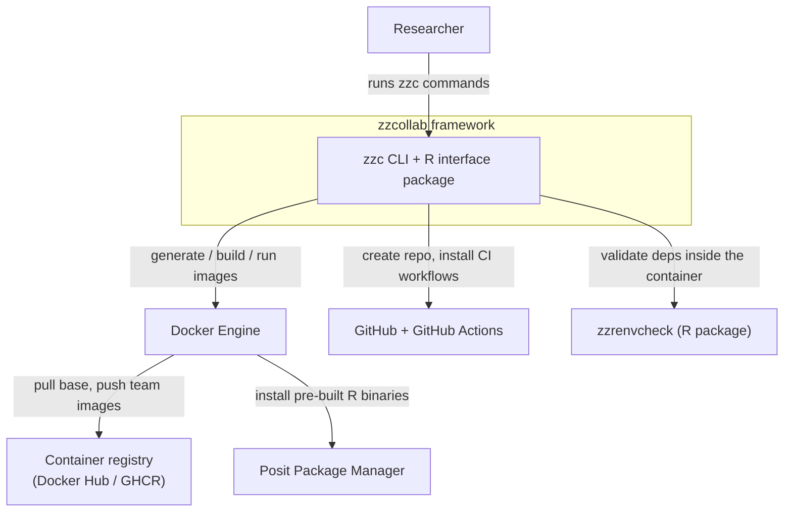
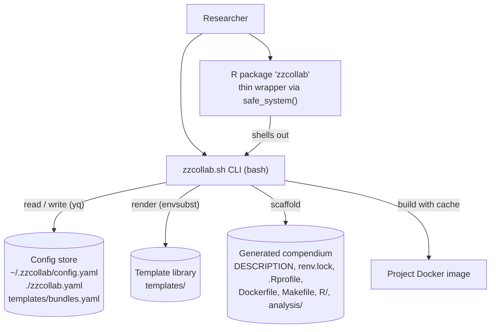
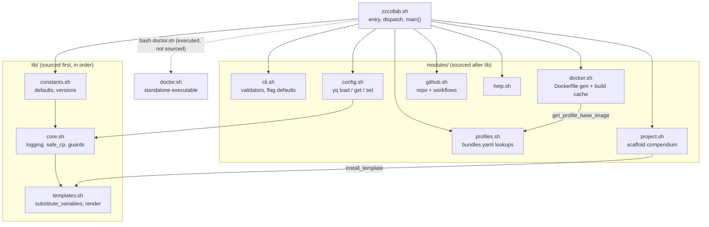
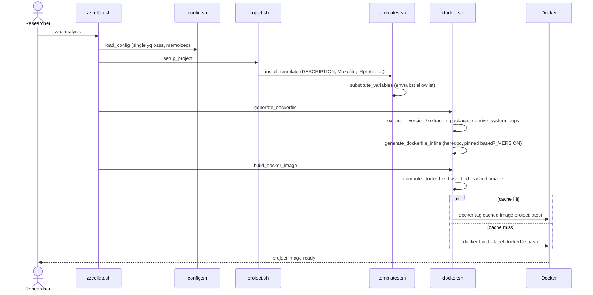
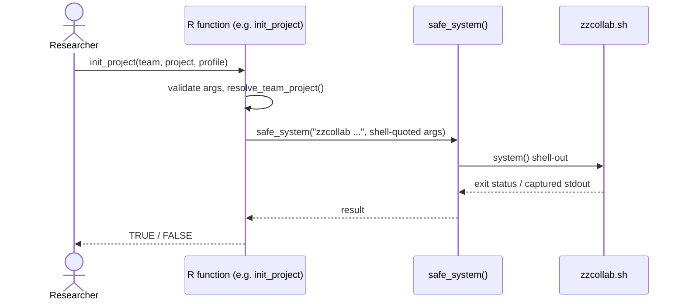
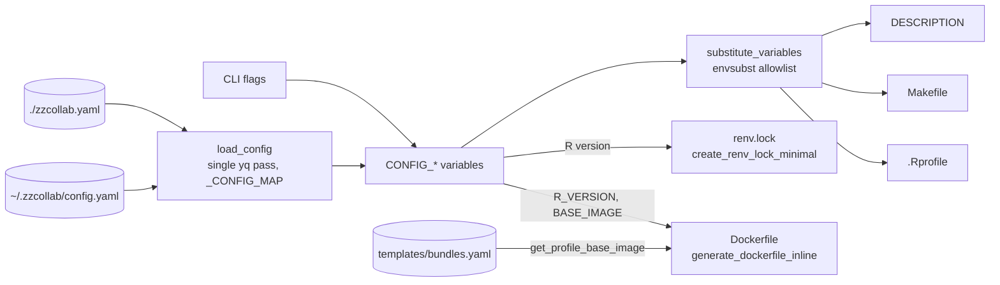
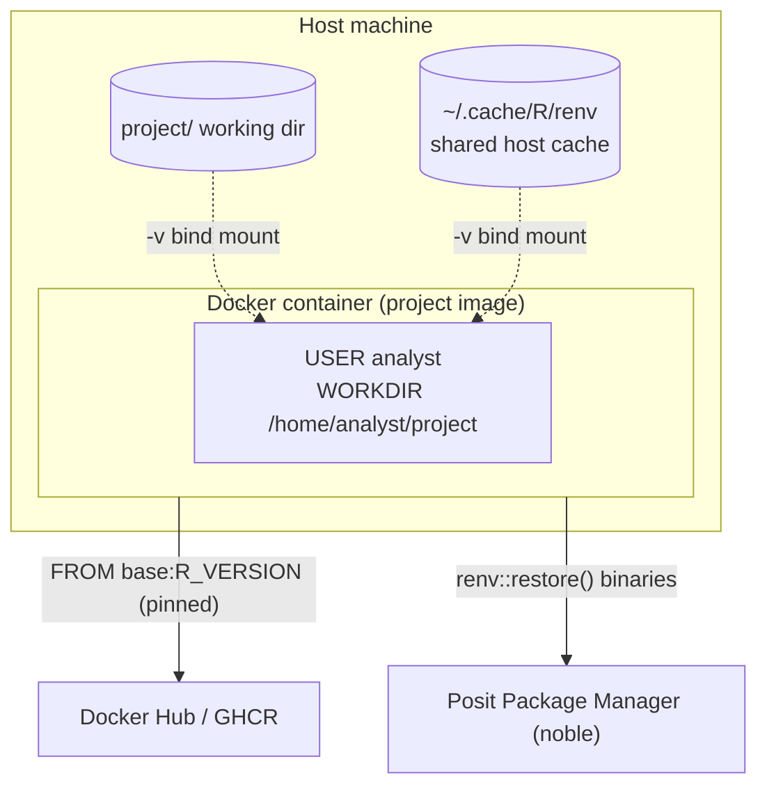
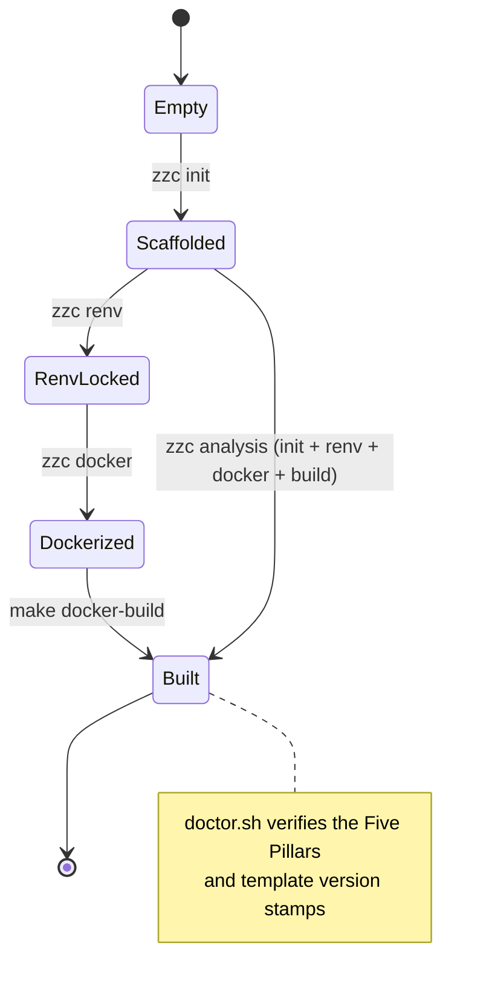

*2026-05-31 18:52 PDT*

This document collects standard software-architecture views of the zzcollab
system as Mermaid diagrams. The set follows the C4 model (context, container,
component) supplemented by a module-dependency view, two interaction
sequences, a data-flow view of the template-substitution pipeline, a runtime
deployment view, and a project-lifecycle state machine.

The diagrams are written in Mermaid fenced blocks. They render natively when
the file is viewed on GitHub and when the document is rendered with Quarto
(`quarto render`). Under plain `rmarkdown::render()` to `html_document`,
Mermaid blocks require the `DiagrammeR` engine or a Mermaid header include;
the source blocks below remain the canonical, version-controlled definition
regardless of renderer.

The views reflect the source after the 2026-05 simplification: modules are
sourced unconditionally in dependency order (no `require_module` system),
`doctor.sh` is executed as a standalone script, dependency validation is
delegated to the `zzrenvcheck` R package, and there are three profiles
(`minimal`, `analysis`, `rstudio`).

## 1. System context (C4 level 1)

The single highest-level view: who uses zzcollab and which external systems
it integrates with. zzcollab is a generator and orchestrator; it owns no
running service of its own.

## 2. Containers (C4 level 2)

The deployable and runnable parts of the system and the data stores they
share. The R package is a thin wrapper that shells out to the bash CLI; the
configuration store and template library are the CLI's inputs, and the
generated compendium plus its Docker image are its outputs.

## 3. Components (C4 level 3) and load order

The internal decomposition of the CLI. `zzcollab.sh` sources the libraries
and modules unconditionally at startup in dependency order
(`constants` then `core` then `templates`, then every module), then
dispatches subcommands. `doctor.sh` is the one exception: it is executed as a
standalone script, not sourced.

## 4. Interaction: generating a project (`zzc analysis`)

The core use case, as a sequence. Configuration is loaded once (memoized),
the compendium is scaffolded with variable substitution, the Dockerfile is
generated from a pinned base image, and the build consults a
content-addressable cache keyed on a hash of the Dockerfile plus `renv.lock`.

## 5. Interaction: the R interface

The R package functions validate and quote their inputs, then delegate to the
bash CLI through `safe_system()`. No business logic is duplicated in R; the
package is an ergonomic front door.

## 6. Data flow: the substitution pipeline

The heart of zzcollab is a substitution pipeline that turns configuration
into the generated artifacts. `load_config` flattens the YAML in a single
`yq` pass into `CONFIG_*` variables; `substitute_variables` fills the
allowlisted placeholders in the text templates; the Dockerfile and
`renv.lock` are generated programmatically rather than templated.

## 7. Runtime deployment

The runtime topology of a generated project. The container is built from a
version-pinned base image; the project directory and a shared host-level renv
cache are bind-mounted at run time, so the container itself stays stateless
and reproducible.

## 8. Project lifecycle (state)

The states a compendium passes through. The individual subcommands advance it
one step at a time; the `analysis` quickstart performs the whole chain.
`doctor.sh` inspects a built workspace to confirm the Five Pillars are present
and their template version stamps are current.

## Notes on scope

These eight views are deliberately a small, standard set rather than the full
UML catalogue. The C4 levels (sections 1 to 3) carry the structural story; the
sequences (4 and 5) and the data-flow view (6) carry the behavioural story;
the deployment (7) and state (8) views carry the runtime and lifecycle story.
A class diagram is omitted because the bash codebase is procedural, and a
code-level (C4 level 4) view is omitted as unnecessary detail for an
architecture document.
