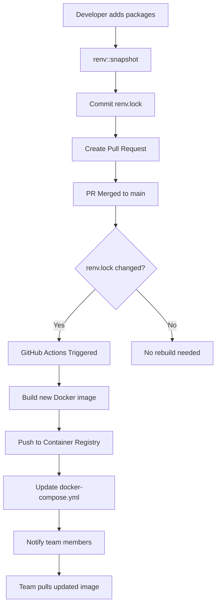

# Developer Collaboration Workflow Sequence

Based on my review of the user guide, here are the specific workflows for developer collaboration using vim as the IDE:

## **🚀 Streamlined Team Collaboration Workflow**

### **🛠️ Initial ZZRRTOOLS Setup (One-time)**
```bash
# 1. Clone and install zzrrtools system
git clone https://github.com/[OWNER]/zzrrtools.git
cd zzrrtools
./install.sh                        # Install to ~/bin (default)

# 2. Verify installation
zzrrtools --help                    # Test installation from anywhere
which zzrrtools                     # Confirm system PATH setup
```

### **📦 Developer 1 (Team Lead): Project Initialization**

**📋 Developer 1 Checklist:**
- [ ] Create new analysis project directory
- [ ] Customize Dockerfile.teamcore for team's R packages and tools
- [ ] Build and push shell core image to Docker Hub
- [ ] Build and push RStudio core image to Docker Hub  
- [ ] Run zzrrtools with dotfiles to create local development image
- [ ] Initialize private GitHub repository and push code
- [ ] Create first analysis script in scripts/ directory
- [ ] Write integration tests for analysis script
- [ ] Run tests to verify everything works
- [ ] Commit and push code + tests together

```bash
# 1. Create new analysis project
mkdir research-project
cd research-project

# 2. Customize team core image for your project
PROJECT_NAME=$(basename $(pwd))    # Get current directory name
# Copy and customize Dockerfile.pluspackages for your team's needs
cp ~/bin/zzrrtools-support/templates/Dockerfile.pluspackages ./Dockerfile.teamcore

# Edit Dockerfile.teamcore to add your team's specific R packages and tools:
vim Dockerfile.teamcore
# Key customizations:
# 1. Ensure first lines support base image argument:
#    ARG BASE_IMAGE=rocker/r-ver
#    ARG R_VERSION=latest  
#    FROM ${BASE_IMAGE}:${R_VERSION}
# 2. Add domain-specific R packages (e.g., 'brms', 'targets', 'cmdstanr')
# 3. Include specialized system tools (e.g., JAGS, Stan, ImageMagick)
# 4. Set team-specific R options and configurations
# 5. Add database drivers or cloud SDKs

# 3. Build TWO team core images for different interfaces  
# Shell-optimized core (rocker/r-ver base - lightweight, fast startup)
docker build -f Dockerfile.teamcore --build-arg BASE_IMAGE=rocker/r-ver \
              -t [TEAM]/${PROJECT_NAME}core-shell:v1.0.0 .
docker tag [TEAM]/${PROJECT_NAME}core-shell:v1.0.0 [TEAM]/${PROJECT_NAME}core-shell:latest

# RStudio-optimized core (rocker/rstudio base - includes RStudio Server)
docker build -f Dockerfile.teamcore --build-arg BASE_IMAGE=rocker/rstudio \
              -t [TEAM]/${PROJECT_NAME}core-rstudio:v1.0.0 .
docker tag [TEAM]/${PROJECT_NAME}core-rstudio:v1.0.0 [TEAM]/${PROJECT_NAME}core-rstudio:latest

# 4. Push both team core images to Docker Hub (PUBLIC for reproducibility)
docker login                       # Login to Docker Hub
docker push [TEAM]/${PROJECT_NAME}core-shell:v1.0.0
docker push [TEAM]/${PROJECT_NAME}core-shell:latest
docker push [TEAM]/${PROJECT_NAME}core-rstudio:v1.0.0
docker push [TEAM]/${PROJECT_NAME}core-rstudio:latest

# 5. Initialize zzrrtools project with dotfiles
zzrrtools --dotfiles ~/dotfiles
# This automatically:
# - Creates complete R package structure
# - Builds LOCAL development image (inherits from core + adds dotfiles)
# - Sets up CI/CD for automated team image rebuilds
# - Local image NOT pushed - contains personal dotfiles

# 6. Set up PRIVATE GitHub repository for research code
git init
git add .
git commit -m "🎉 Initial research project setup

- Complete zzrrtools research compendium  
- Team core image published to Docker Hub: [TEAM]/${PROJECT_NAME}core:v1.0.0
- Private repository protects unpublished research
- CI/CD configured for automatic team image updates"

# Create PRIVATE repository on GitHub first, then:
git remote add origin https://github.com/[TEAM]/project.git  # PRIVATE repo
git push -u origin main

# 7. Start development immediately
make docker-zsh                   # Enter containerized development environment with your dotfiles
```

### **📊 Developer 1: Analysis Development Cycle**
```bash
# Inside the container (after make docker-zsh):

# 1. Create initial analysis script
vim scripts/01_initial_analysis.R
# Write first iteration of analysis in R

# 2. Write tests for the analysis immediately
vim tests/integration/test-01_initial_analysis.R
# Write integration tests:
# test_that("initial analysis script runs without errors", {
#   expect_no_error(source(here("scripts", "01_initial_analysis.R")))
#   expect_true(file.exists(here("data", "derived_data", "analysis_output.rds")))
# })

# 3. Run tests to verify everything works
R
# testthat::test_dir("tests/integration")  # Run integration tests
# source("scripts/01_initial_analysis.R")  # Test the script directly
# quit()

# 4. Exit container when iteration is complete
exit

# 5. Commit and push changes (code + tests together)
git add .
git commit -m "Add initial analysis script with tests

- First iteration of data analysis
- Created scripts/01_initial_analysis.R
- Added integration tests for analysis pipeline
- All tests passing"
git push

# 6. CI automatically handles package updates
# - If new packages detected: renv::snapshot() runs
# - Team Docker image rebuilds automatically
# - New image pushed to Docker Hub
# - Team gets notification of updated environment

# 7. Continue development cycle
make docker-zsh                   # Back to development environment
# Repeat: code → test → exit → commit → push
```

### **🚀 Benefits of Automated Team Image Management:**
- **⚡ Faster onboarding**: New developers get started in minutes, not hours
- **🔒 Environment consistency**: Everyone uses identical package versions
- **💾 Bandwidth efficiency**: ~500MB pull vs ~2GB+ rebuild
- **🛠️ CI/CD optimization**: Faster automated testing with pre-built dependencies
- **📦 Package management**: Centralized control over research environment
- **🔄 Version control**: Tag images for different analysis phases
- **🤖 Automated updates**: Team image rebuilds automatically when packages change
- **🚫 Zero manual intervention**: Developers never worry about image management

### **🤖 Automated Team Image Updates**

ZZRRTOOLS includes automated GitHub Actions workflows that rebuild and publish the team Docker image whenever package dependencies change. This ensures all team members always have access to the latest, consistent development environment.

**Key Benefits:**
- **Zero manual intervention** required for Docker image management
- **Automatic detection** of package changes in `renv.lock` or `DESCRIPTION`
- **Multi-tag versioning** for different use cases
- **Team notification** system for new image availability
- **Build caching** for faster rebuild times

*Full documentation and implementation details are provided in the [Automated Docker Image Management](#automated-docker-image-management) section at the end of this document.*

## **Developer Collaboration Workflow Sequence**

### **🧑‍💻 Developer 1 (Initial Development Work)**
```bash
# Project setup already completed in pre-collaboration phase
cd research-project

# 1. Start development work in containerized vim environment
make docker-zsh                 # → Enhanced zsh shell with personal dotfiles

# 2. Add any additional packages for initial analysis
# (In zsh container with vim IDE)
R                               # Start R session
# Most packages already installed in team image
# install.packages("additional_package") # Only if needed
# renv::snapshot()              # Update if packages added
# quit()                        # Exit R

# 3. Test-driven development workflow using vim
# First, learn testing patterns
Rscript scripts/00_testing_guide.R   # → Review testing instructions

# Create package functions with tests
vim R/analysis_functions.R           # Create package functions
# Write R functions with vim + plugins

vim tests/testthat/test-analysis_functions.R  # Write tests for functions
# Write unit tests for each function:
# test_that("function_name works correctly", {
#   result <- my_function(test_data)
#   expect_equal(nrow(result), expected_value)
#   expect_true(all(result$column > 0))
# })

# Test the functions
R                                    # Start R session
# devtools::load_all()               # Load package functions
# devtools::test()                   # Run tests to verify functions work
# quit()                             # Exit R

vim scripts/01_data_import.R         # Create analysis scripts  
# Write data import code
# Note: scripts/ directory includes templates for:
# - 02_data_validation.R (data quality checks)
# - 00_setup_parallel.R (high-performance computing)
# - 00_database_setup.R (database connections)
# - 99_reproducibility_check.R (validation)
# - 00_testing_guide.R (testing instructions)

vim tests/integration/test-data_import.R  # Create integration tests
# Write integration tests for analysis scripts:
# test_that("data import script runs without errors", {
#   expect_no_error(source(here("scripts", "01_data_import.R")))
# })

vim analysis/paper/paper.Rmd        # Start research paper
# Write analysis and methods in R Markdown

# Test paper rendering
R                                   # Start R session
# rmarkdown::render("analysis/paper/paper.Rmd")  # Test paper compiles
# quit()                            # Exit R

# 4. Quality assurance and commit
exit                            # Exit container
make docker-check-renv-fix      # Validate dependencies
make docker-test                # Run package tests
make docker-render              # Test paper rendering
# Rscript scripts/99_reproducibility_check.R  # Optional: Check reproducibility

# 5. Commit changes with CI/CD trigger
git add .
git commit -m "Add initial analysis and dependencies"
git push                        # → Triggers GitHub Actions validation
```

### **👩‍💻 Developer 2 (Joining Project)**

**📋 Developer 2 Checklist:**
- [ ] Get access to private GitHub repository from team lead
- [ ] Clone the private repository to local machine
- [ ] Choose preferred development interface (shell or RStudio)
- [ ] Update docker-compose.yml to reference chosen core image
- [ ] Build local development image with personal dotfiles
- [ ] Create feature branch for your analysis work
- [ ] Write analysis script in scripts/ directory
- [ ] Write integration tests for your analysis script
- [ ] Run tests to verify everything works
- [ ] Commit and push code + tests together
- [ ] Create pull request for team review

```bash
# 1. Get access to PRIVATE repository and clone
# Team lead must add you as collaborator to private GitHub repo first
git clone https://github.com/[TEAM]/project.git  # PRIVATE repo - requires access
cd project

# 2. Choose your preferred development interface
PROJECT_NAME=$(basename $(pwd))    # Get current directory name

# Option A: Shell-based development (lightweight, fast)
# Edit docker-compose.yml to reference shell core:
# image: [TEAM]/${PROJECT_NAME}core-shell:latest

# Option B: RStudio-based development (web interface)  
# Edit docker-compose.yml to reference RStudio core:
# image: [TEAM]/${PROJECT_NAME}core-rstudio:latest

# 3. Build local image with your dotfiles (inherits from chosen core image)
make docker-build --build-arg DOTFILES_DIR=~/dotfiles
# This builds on top of your chosen team core image, adding personal dotfiles

# 4. Start development with your preferred interface
make docker-zsh                   # Shell interface with vim/tmux
# OR
make docker-rstudio              # RStudio Server at localhost:8787

# 4. Create feature branch for your work
git checkout -b feature/visualization-analysis

# 5. Add your analysis work (inside container)
# (In zsh container with vim)
vim scripts/02_visualization_analysis.R
# Write visualization analysis code
# If you need new packages, just install them:
# R
# install.packages("ggplot2")   # Add new package  
# quit()

# 6. Write tests for your analysis immediately
vim tests/integration/test-02_visualization_analysis.R
# Write integration tests:
# test_that("visualization analysis runs successfully", {
#   expect_no_error(source(here("scripts", "02_visualization_analysis.R")))
#   expect_true(file.exists(here("analysis", "figures", "plot1.png")))
# })

# 7. Run tests to verify everything works
R
# testthat::test_dir("tests/integration")  # Run all integration tests
# source("scripts/02_visualization_analysis.R")  # Test your script
# quit()

exit

# 8. Commit and push your changes (code + tests together)
git add .
git commit -m "Add visualization analysis with tests

- Created scripts/02_visualization_analysis.R
- Added ggplot2 for data visualization
- Added integration tests for visualization pipeline
- All tests passing"
git push origin feature/visualization-analysis

# 9. Create pull request
gh pr create --title "Add visualization analysis with tests" \
             --body "Added visualization analysis script with comprehensive tests" \
             --base main

# 10. CI automatically handles the rest!
# - If new packages detected: renv::snapshot() runs
# - Team Docker image rebuilds automatically  
# - New image pushed to Docker Hub
# - Team gets notification of updated environment
```

### **🧑‍💻 Developer 1 (Continuing Work - After PR Review)**
```bash
# 1. Review and merge Developer 2's pull request
# On GitHub: Review PR, approve, and merge to main branch

# 2. Sync with Developer 2's merged changes
git checkout main               # Switch to main branch
git pull upstream main          # Get latest changes from team repo
git push origin main            # Update your fork's main branch

# 3. Get latest team Docker image (automatically updated by GitHub Actions)
docker pull [TEAM]/$(cat .project-name):latest  # Pull from Docker Hub (public)
# Note: If Dev 2 added packages, GitHub Actions already rebuilt and pushed the image!

# 4. Validate environment consistency
make docker-check-renv-fix     # Ensure all dependencies are properly tracked

# 5. Create new feature branch for advanced modeling
git checkout -b feature/advanced-models

# 6. Continue development with updated environment
make docker-zsh                # → Environment now includes Dev 2's packages

# 7. Add more analysis work using vim
# (In zsh container with vim)
R                              # Start R session
# renv::restore()              # Ensure all packages from Dev 2 are available
# devtools::load_all()         # Load updated package with new functions
# quit()

# 8. Test-driven advanced analysis development
vim R/modeling_functions.R     # Add statistical modeling functions
# Write multilevel model functions

vim tests/testthat/test-modeling_functions.R  # Write tests for modeling functions
# Write unit tests for statistical models:
# test_that("multilevel_model function works", {
#   model <- fit_multilevel_model(test_data)
#   expect_s3_class(model, "lmerMod")
#   expect_true(length(fixef(model)) > 0)
# })

# Test new modeling functions
R                              # Start R for testing
# devtools::load_all()         # Load all functions including new ones
# devtools::test()             # Run all tests (Dev 1, Dev 2, and new tests)
# quit()

vim scripts/03_advanced_models.R  # Create modeling script
# Write analysis using both Dev 1 and Dev 2's functions

vim tests/integration/test-complete_pipeline.R  # Create comprehensive integration tests
# Write end-to-end pipeline tests:
# test_that("complete analysis pipeline works", {
#   expect_no_error(source(here("scripts", "01_data_import.R")))
#   expect_no_error(source(here("scripts", "02_visualization.R")))
#   expect_no_error(source(here("scripts", "03_advanced_models.R")))
# })

# 7. Test complete integration of all developers' work
R                              # Comprehensive integration testing
# devtools::load_all()         # Load all functions
# testthat::test_dir("tests/testthat")      # Run all unit tests
# testthat::test_dir("tests/integration")  # Run all integration tests
# source("scripts/01_data_import.R")       # Dev 1's work
# source("scripts/02_visualization.R")     # Dev 2's work  
# source("scripts/03_advanced_models.R")   # New integration
# quit()

# 8. Update research paper with testing
vim analysis/paper/paper.Rmd  # Update manuscript
# Add new results and figures

vim tests/integration/test-paper_rendering.R  # Create paper rendering tests
# Write tests for paper compilation:
# test_that("paper renders successfully", {
#   expect_no_error(rmarkdown::render(here("analysis", "paper", "paper.Rmd")))
#   expect_true(file.exists(here("analysis", "paper", "paper.pdf")))
# })

# Test paper rendering
R                              # Test paper compilation
# rmarkdown::render("analysis/paper/paper.Rmd")  # Verify paper compiles
# testthat::test_dir("tests/integration")         # Run all integration tests
# quit()

# 11. Enhanced collaboration workflow with proper PR
exit                          # Exit container

# 12. Create comprehensive pull request
git add .
git commit -m "Add advanced multilevel modeling with integrated visualization

- Add modeling_functions.R with multilevel model utilities
- Create comprehensive test suite for statistical models
- Add end-to-end pipeline integration tests
- Update research paper with new analysis results
- Test complete workflow integration"

# Push feature branch to your fork
git push origin feature/advanced-models

# 13. Create pull request with detailed review checklist
gh pr create --title "Add advanced multilevel modeling analysis" \
             --body "## Summary
- Integrates visualization functions from previous PR
- Adds multilevel modeling capabilities with lme4
- Includes comprehensive end-to-end testing
- Updates research manuscript with new results

## Analysis Impact Assessment
- [x] All existing functionality preserved
- [x] New models compatible with existing visualization pipeline
- [x] Data validation passes for modeling requirements
- [x] Reproducibility check passes

## Testing Coverage
- [x] Unit tests for all modeling functions
- [x] Integration tests for complete analysis pipeline
- [x] Paper rendering validation with new results
- [x] All existing tests continue to pass

## Reproducibility Validation
- [x] renv.lock updated with new dependencies
- [x] Docker environment builds successfully
- [x] Analysis runs from clean environment
- [x] Results consistent across platforms

## Collaboration Quality
- [x] Code follows established patterns
- [x] Functions integrate cleanly with existing codebase
- [x] Documentation updated for new capabilities
- [x] Commit messages follow conventional format" \
             --base main
```

### **🔄 Key Collaboration Features (Professional Git Workflow + Test-Driven Development)**

#### **Automated Quality Assurance on Every Push:**
- ✅ **R Package Validation**: R CMD check with dependency validation
- ✅ **Comprehensive Testing Suite**: Unit tests, integration tests, and data validation
- ✅ **Paper Rendering**: Automated PDF generation and artifact upload
- ✅ **Multi-platform Testing**: Ensures compatibility across environments
- ✅ **Dependency Sync**: renv validation and DESCRIPTION file updates

#### **Test-Driven Development Workflow:**
- **Unit Tests**: Every R function has corresponding tests in `tests/testthat/`
- **Integration Tests**: Analysis scripts tested end-to-end in `tests/integration/`
- **Data Validation**: Automated data quality checks using `scripts/02_data_validation.R`
- **Reproducibility Testing**: Environment validation with `scripts/99_reproducibility_check.R`
- **Paper Testing**: Manuscript rendering validation for each commit

#### **Enhanced GitHub Templates:**
- **Pull Request Template**: Analysis impact assessment, reproducibility checklist
- **Issue Templates**: Bug reports with environment details, feature requests with research use cases
- **Collaboration Guidelines**: Research-specific workflow standards

#### **Fully Automated Professional Workflow:**
```bash
# Fork-based collaboration with pull requests:
git clone https://github.com/[YOUR-USERNAME]/project.git  # Clone your fork
git remote add upstream https://github.com/[TEAM]/project.git  # Add team repo
git checkout -b feature/your-analysis    # Create feature branch
# ... do development work with tests ...
git push origin feature/your-analysis   # Push to your fork
gh pr create --title "Add analysis" --body "..."  # Create pull request

# After PR merge - ZERO manual image management needed:
git checkout main             # Switch to main branch  
git pull upstream main        # Get latest from team repo
docker pull team/project:latest  # Get auto-updated team image from Docker Hub
make docker-zsh              # → Instantly ready with all new packages!

# 🤖 GitHub Actions automatically:
# - Detects renv.lock changes in merged PR
# - Rebuilds Docker image with new packages  
# - Pushes updated image to container registry
# - Updates docker-compose.yml references
# - Notifies team of new image availability
```

#### **Data Management Collaboration:**
```bash
# Structured data workflow for teams:
data/
├── raw_data/                 # Dev 1 adds original datasets
├── derived_data/             # Dev 2 adds processed data  
├── metadata/                 # Both document data sources
└── validation/               # Automated quality reports
```

## **🛠️ Vim IDE Development Environment**

### **Enhanced Vim Setup (via zzrrtools dotfiles)**
The containerized environment includes a fully configured vim IDE with:

#### **Vim Plugin Ecosystem:**
- **vim-plug**: Plugin manager (automatically installed)
- **R Language Support**: Syntax highlighting and R integration
- **File Navigation**: Project file browser and fuzzy finding
- **Git Integration**: Git status and diff visualization
- **Code Completion**: Intelligent autocomplete for R functions

#### **Essential Vim Workflow Commands:**
```bash
# In container vim session:
vim R/analysis.R               # Open R file
:Explore                       # File browser
:split scripts/data.R          # Split window editing
:vsplit analysis/paper.Rmd     # Vertical split for manuscript

# Vim + R integration:
:terminal                      # Open terminal in vim
R                             # Start R session in terminal
# devtools::load_all()         # Load package functions (in R)
# :q                           # Exit R, back to vim

# Git workflow in vim:
:!git status                   # Check git status
:!git add %                    # Add current file
:!git commit -m "Update analysis"  # Commit changes
```

#### **Productive Development Cycle:**
```bash
# 1. Start development environment
make docker-zsh               # → Enhanced zsh with vim

# 2. Multi-file development workflow
vim -p R/functions.R scripts/analysis.R analysis/paper/paper.Rmd
# Opens multiple files in tabs

# 3. Interactive R testing
:terminal                     # Open terminal in vim
R                            # Start R
# devtools::load_all()        # Test functions
# source("scripts/analysis.R") # Test scripts
# quit()                      # Exit R

# 4. File navigation and editing
# gt (next tab), gT (previous tab)
# Ctrl+w+w (switch windows)
# :Explore (file browser)

# 5. Test-driven development cycle from vim
:!make docker-test           # Run all package tests from vim
:!make docker-render         # Render paper from vim
:terminal                    # Open terminal for interactive testing
R                           # Start R in terminal
# devtools::load_all()       # Load package functions
# devtools::test()           # Run specific tests
# testthat::test_dir("tests/integration")  # Run integration tests
# quit()                     # Exit R, back to vim
```

### **Vim + R Development Tips:**

#### **File Organization in Vim:**
```bash
# Open related files simultaneously:
vim -O R/analysis_functions.R scripts/01_analysis.R    # Side by side
vim -o R/plotting.R analysis/figures/                  # Horizontal split
vim -p R/*.R scripts/*.R                               # All R files in tabs
```

#### **Git Integration Workflow:**
```bash
# In vim, check git status frequently:
:!git status                  # See changed files
:!git diff %                  # Diff current file
:!git add %                   # Stage current file
:!git commit -m "Add function"  # Commit from vim

# View git log:
:!git log --oneline -10       # Recent commits
```

#### **Test-Driven R Package Development in Vim:**
```bash
# Test-driven development cycle:
vim tests/testthat/test-new_function.R  # Write test first
vim R/new_function.R                    # Write function to pass test
:!make docker-test                      # Run tests from vim
vim man/new_function.Rd                 # Check documentation
:!make docker-check                     # Package validation

# Open multiple files for TDD:
vim -p R/my_function.R tests/testthat/test-my_function.R  # Side-by-side development
```

#### **Testing Workflow Tips:**
```bash
# Quick testing commands in vim:
:!devtools::test()                      # Run all package tests
:!testthat::test_file("tests/testthat/test-my_function.R")  # Test specific file
:!Rscript scripts/02_data_validation.R # Validate data quality
:!Rscript scripts/99_reproducibility_check.R  # Check reproducibility

# Testing with different data:
:!R -e "testthat::test_dir('tests/integration')"  # Integration tests
:!R -e "source('scripts/01_data_import.R')"       # Test analysis scripts
```

## **🚀 Automation Summary: Zero-Friction Collaboration**

This fully automated workflow provides **enterprise-grade collaboration** for research teams:

### **🔄 Complete Automation Cycle:**
1. **Developer adds packages** → `renv::snapshot()` → commits `renv.lock`
2. **Pull request merged** → **GitHub Actions triggered automatically**
3. **New Docker image built** → **pushed to container registry**  
4. **docker-compose.yml updated** → **team notified via commit comment**
5. **Other developers sync** → `docker pull` → **instant access to new packages**

### **📊 Automation Benefits:**

| Traditional Workflow | Automated ZZRRTOOLS Workflow |
|----------------------|------------------------------|
| Manual image rebuilds | ✅ **Automatic rebuilds on package changes** |
| Inconsistent environments | ✅ **Guaranteed environment consistency** |
| 30-60 min setup per developer | ✅ **3-5 min setup with pre-built images** |
| Manual dependency management | ✅ **Automated dependency tracking** |
| Docker expertise required | ✅ **Zero Docker knowledge needed** |
| Build failures block development | ✅ **Centralized, tested builds** |

### **🎯 Developer Experience:**
- **Researchers focus on research** - not DevOps
- **Onboarding new team members** takes minutes, not hours
- **Package management** happens transparently
- **Environment drift** is impossible
- **Collaboration friction** eliminated entirely

This workflow ensures **perfect reproducibility** across team members while providing **fully automated infrastructure management**, **professional collaboration tools**, and **comprehensive testing frameworks** - all accessible through a powerful vim-based development environment with **zero manual Docker management required**.

---

## **Automated Docker Image Management**

### **Overview**

ZZRRTOOLS includes a sophisticated automated Docker image management system that eliminates manual container maintenance while ensuring perfect environment consistency across research teams. This system automatically detects package changes, rebuilds Docker images, and notifies team members - providing enterprise-grade DevOps automation for research workflows.

### **🏗️ Architecture**



### **📋 Complete GitHub Actions Workflow**

The automated system is implemented through a comprehensive GitHub Actions workflow located at `.github/workflows/update-team-image.yml`:

```yaml
# .github/workflows/update-team-image.yml
# Automated Team Docker Image Management for ZZRRTOOLS Research Projects
# 
# PURPOSE: Automatically rebuild and publish team Docker images when R package
#          dependencies change, ensuring consistent environments across team members
#
# TRIGGERS: 
#   - Push to main branch with changes to renv.lock or DESCRIPTION
#   - Manual workflow dispatch for on-demand builds
#
# OUTPUTS:
#   - Updated Docker image in GitHub Container Registry
#   - Multiple image tags for different use cases
#   - Automatic docker-compose.yml updates
#   - Team notification via commit comments

name: Update Team Docker Image

on:
  push:
    branches: [main]
    paths: 
      - 'renv.lock'           # R package dependency changes
      - 'DESCRIPTION'         # Package metadata changes
      - 'Dockerfile'          # Container definition changes
      - 'docker-compose.yml'  # Service configuration changes
  workflow_dispatch:           # Allow manual triggering
    inputs:
      force_rebuild:
        description: 'Force rebuild even if no package changes'
        required: false
        default: false
        type: boolean

env:
  REGISTRY: docker.io
  IMAGE_NAME: [TEAM]/$(cat .project-name)  # Docker Hub public repository

jobs:
  update-team-image:
    name: Build and Publish Team Docker Image
    runs-on: ubuntu-latest
    permissions:
      contents: write          # Needed to update docker-compose.yml
      actions: read           # Needed for caching
      # Note: Docker Hub publishing uses repository secrets, not GitHub permissions
    
    outputs:
      image-digest: ${{ steps.build.outputs.digest }}
      r-version: ${{ steps.r-version.outputs.version }}
      
    steps:
      - name: Checkout repository
        uses: actions/checkout@v4
        with:
          token: ${{ secrets.GITHUB_TOKEN }}
          fetch-depth: 2       # Needed for git diff comparison
      
      - name: Check if rebuild is needed
        id: check-rebuild
        run: |
          if [ "${{ github.event.inputs.force_rebuild }}" == "true" ]; then
            echo "rebuild=true" >> $GITHUB_OUTPUT
            echo "reason=Manual force rebuild requested" >> $GITHUB_OUTPUT
          elif git diff HEAD~1 --name-only | grep -E "(renv\.lock|DESCRIPTION|Dockerfile|docker-compose\.yml)"; then
            echo "rebuild=true" >> $GITHUB_OUTPUT
            echo "reason=Package or container configuration changes detected" >> $GITHUB_OUTPUT
          else
            echo "rebuild=false" >> $GITHUB_OUTPUT
            echo "reason=No relevant changes detected" >> $GITHUB_OUTPUT
          fi
      
      - name: Extract R version and package info
        id: r-version
        if: steps.check-rebuild.outputs.rebuild == 'true'
        run: |
          if [ -f "renv.lock" ]; then
            R_VERSION=$(jq -r '.R.Version // "4.3.0"' renv.lock)
            PACKAGE_COUNT=$(jq '.Packages | length' renv.lock)
          else
            R_VERSION="4.3.0"
            PACKAGE_COUNT="0"
          fi
          echo "version=${R_VERSION}" >> $GITHUB_OUTPUT
          echo "package-count=${PACKAGE_COUNT}" >> $GITHUB_OUTPUT
          
          # Extract package names for change detection
          if [ -f "renv.lock" ]; then
            jq -r '.Packages | keys[]' renv.lock | sort > current_packages.txt
          else
            touch current_packages.txt
          fi
          
          # Compare with previous version if available
          if git show HEAD~1:renv.lock 2>/dev/null | jq -r '.Packages | keys[]' | sort > previous_packages.txt; then
            NEW_PACKAGES=$(comm -13 previous_packages.txt current_packages.txt | tr '\n' ' ')
            REMOVED_PACKAGES=$(comm -23 previous_packages.txt current_packages.txt | tr '\n' ' ')
            echo "new-packages=${NEW_PACKAGES}" >> $GITHUB_OUTPUT
            echo "removed-packages=${REMOVED_PACKAGES}" >> $GITHUB_OUTPUT
          else
            echo "new-packages=" >> $GITHUB_OUTPUT
            echo "removed-packages=" >> $GITHUB_OUTPUT
          fi
      
      - name: Set up Docker Buildx
        if: steps.check-rebuild.outputs.rebuild == 'true'
        uses: docker/setup-buildx-action@v3
        with:
          platforms: linux/amd64,linux/arm64  # Multi-platform support
      
      - name: Log in to Docker Hub
        if: steps.check-rebuild.outputs.rebuild == 'true'
        uses: docker/login-action@v3
        with:
          registry: ${{ env.REGISTRY }}
          username: ${{ secrets.DOCKERHUB_USERNAME }}
          password: ${{ secrets.DOCKERHUB_TOKEN }}
      
      - name: Extract metadata for Docker
        if: steps.check-rebuild.outputs.rebuild == 'true'
        id: meta
        uses: docker/metadata-action@v5
        with:
          images: ${{ env.REGISTRY }}/${{ env.IMAGE_NAME }}
          tags: |
            type=ref,event=branch
            type=sha,prefix={{branch}}-
            type=raw,value=latest
            type=raw,value=r${{ steps.r-version.outputs.version }}
            type=raw,value={{date 'YYYY-MM-DD'}}
          labels: |
            org.opencontainers.image.title=ZZRRTOOLS Research Environment
            org.opencontainers.image.description=Automated team Docker image for research collaboration
            org.opencontainers.image.vendor=ZZRRTOOLS
            research.zzrrtools.r-version=${{ steps.r-version.outputs.version }}
            research.zzrrtools.package-count=${{ steps.r-version.outputs.package-count }}
      
      - name: Build and push Docker image
        if: steps.check-rebuild.outputs.rebuild == 'true'
        id: build
        uses: docker/build-push-action@v5
        with:
          context: .
          platforms: linux/amd64,linux/arm64
          push: true
          tags: ${{ steps.meta.outputs.tags }}
          labels: ${{ steps.meta.outputs.labels }}
          cache-from: type=gha
          cache-to: type=gha,mode=max
          build-args: |
            R_VERSION=${{ steps.r-version.outputs.version }}
            BUILDKIT_INLINE_CACHE=1
          provenance: true
          sbom: true
      
      - name: Update docker-compose.yml with new image
        if: steps.check-rebuild.outputs.rebuild == 'true'
        run: |
          # Update image reference in docker-compose.yml
          sed -i "s|image: .*|image: ${{ env.REGISTRY }}/${{ env.IMAGE_NAME }}:latest|g" docker-compose.yml
          
          # Check if there are actual changes
          if git diff --quiet docker-compose.yml; then
            echo "No changes needed to docker-compose.yml"
          else
            echo "Updating docker-compose.yml with new image reference"
            
            # Configure git for automated commit
            git config --local user.email "action@github.com"
            git config --local user.name "ZZRRTOOLS AutoBot"
            
            # Commit the updated docker-compose.yml
            git add docker-compose.yml
            git commit -m "🤖 Auto-update team Docker image reference

            - Updated docker-compose.yml to use latest team image
            - Triggered by: ${{ steps.check-rebuild.outputs.reason }}
            - Commit: ${{ github.sha }}
            - R version: ${{ steps.r-version.outputs.version }}
            - Total packages: ${{ steps.r-version.outputs.package-count }}
            - Image: ${{ env.REGISTRY }}/${{ env.IMAGE_NAME }}:latest
            
            Changes:
            - New packages: ${{ steps.r-version.outputs.new-packages }}
            - Removed packages: ${{ steps.r-version.outputs.removed-packages }}"
            
            # Push the changes
            git push
          fi
      
      - name: Create detailed team notification
        if: steps.check-rebuild.outputs.rebuild == 'true'
        uses: actions/github-script@v7
        with:
          script: |
            const { owner, repo } = context.repo;
            const sha = context.sha.substring(0, 7);
            const rVersion = '${{ steps.r-version.outputs.version }}';
            const packageCount = '${{ steps.r-version.outputs.package-count }}';
            const newPackages = '${{ steps.r-version.outputs.new-packages }}'.trim();
            const removedPackages = '${{ steps.r-version.outputs.removed-packages }}'.trim();
            const reason = '${{ steps.check-rebuild.outputs.reason }}';
            
            let changeDetails = '';
            if (newPackages) {
              changeDetails += `**📦 New packages added**: ${newPackages}\n`;
            }
            if (removedPackages) {
              changeDetails += `**🗑️ Packages removed**: ${removedPackages}\n`;
            }
            if (!newPackages && !removedPackages) {
              changeDetails = '**🔄 Configuration or container changes detected**\n';
            }
            
            github.rest.repos.createCommitComment({
              owner,
              repo,
              commit_sha: context.sha,
              body: `🐳 **Team Docker Image Updated Successfully**
              
              **📊 Build Summary**:
              - **R Version**: ${rVersion}
              - **Total Packages**: ${packageCount}
              - **Trigger**: ${reason}
              - **Build ID**: ${sha}
              
              ${changeDetails}
              
              **🚀 For Team Members**:
              \`\`\`bash
              # Get the updated environment
              docker pull ${owner}/${repo}:latest
              
              # Start development with new packages
              make docker-zsh
              # OR
              make docker-rstudio
              \`\`\`
              
              **🏷️ Available Image Tags**:
              - \`latest\` - Most recent build (recommended)
              - \`r${rVersion}\` - R version specific
              - \`${sha}\` - This exact commit
              - \`$(date +%Y-%m-%d)\` - Today's date
              
              **✅ Environment Status**:
              - ✅ All package dependencies are now available
              - ✅ Multi-platform support (AMD64, ARM64)  
              - ✅ Build cache optimized for faster updates
              - ✅ docker-compose.yml automatically updated
              
              **🔍 View Details**:
              - [Build logs](https://github.com/${owner}/${repo}/actions/runs/${{ github.run_id }})
              - [Container registry](https://github.com/${owner}/${repo}/pkgs/container/${repo.toLowerCase()})
              
              Happy researching! 🎉`
            });
      
      - name: Skip notification for no-rebuild
        if: steps.check-rebuild.outputs.rebuild == 'false'
        run: |
          echo "ℹ️ Skipping Docker image rebuild: ${{ steps.check-rebuild.outputs.reason }}"
          echo "Current team image is up to date."
```

### **🔧 Key Features**

#### **1. Intelligent Change Detection**
- **Monitors**: `renv.lock`, `DESCRIPTION`, `Dockerfile`, `docker-compose.yml`
- **Smart analysis**: Compares package lists between commits
- **Detailed reporting**: Tracks new packages, removed packages, and configuration changes
- **Skip unnecessary builds**: Only rebuilds when actual changes are detected

#### **2. Multi-Platform Support**
- **Architectures**: AMD64 (Intel/AMD) and ARM64 (Apple Silicon, ARM servers)
- **Cross-platform compatibility**: Works on all modern development machines
- **Universal deployment**: Single image works across different team hardware

#### **3. Advanced Caching Strategy**
- **GitHub Actions cache**: Reuses Docker layers across builds
- **BuildKit inline cache**: Optimizes local Docker builds
- **Layer optimization**: Minimizes rebuild time for incremental changes
- **Cache invalidation**: Smart cache management based on package changes

#### **4. Comprehensive Tagging System**
- **`latest`**: Most recent build (recommended for development)
- **`r4.3.0`**: R version specific (for reproducibility)
- **`abc1234`**: Commit SHA (for exact version tracking)
- **`2024-01-15`**: Date-based (for time-based rollbacks)
- **`main-abc1234`**: Branch and commit combination

#### **5. Automated Configuration Management**
- **docker-compose.yml updates**: Automatically points to new image
- **Git integration**: Commits configuration changes automatically
- **Change tracking**: Documents what triggered the rebuild
- **Rollback capability**: Git history preserves all image references

#### **6. Team Communication System**
- **Commit comments**: Detailed notifications on the triggering commit
- **Change summaries**: Lists new/removed packages and configuration changes
- **Usage instructions**: Provides exact commands for team members
- **Build links**: Direct access to build logs and container registry

### **📊 Usage Scenarios**

#### **Scenario 1: Developer Adds New Package**
```bash
# Developer workflow
R
install.packages("tidymodels")
renv::snapshot()
# Create PR and merge

# Automatic result:
# ✅ GitHub Actions detects renv.lock changes
# ✅ Rebuilds image with tidymodels
# ✅ Pushes to team/project:latest on Docker Hub
# ✅ Updates docker-compose.yml
# ✅ Notifies team via commit comment
```

#### **Scenario 2: Manual Force Rebuild**
```bash
# Team lead can trigger manual rebuild
gh workflow run update-team-image.yml -f force_rebuild=true

# Use cases:
# - Base image security updates
# - Docker configuration changes
# - Periodic refresh of build cache
```

#### **Scenario 3: New Team Member Onboarding**
```bash
# New developer setup
git clone https://github.com/team/project.git
cd project
docker pull team/project:latest  # Gets latest team image from Docker Hub
make docker-zsh                          # Instant development environment
```

### **🔍 Monitoring and Troubleshooting**

#### **Build Status Monitoring**
- **GitHub Actions tab**: Real-time build progress and logs
- **Container registry**: Image versions and download statistics
- **Commit comments**: Success/failure notifications with details

#### **Common Issues and Solutions**

| Issue | Symptoms | Solution |
|-------|----------|----------|
| **Build failures** | Red X on GitHub Actions | Check build logs, verify Dockerfile syntax |
| **Large image sizes** | Slow pull times | Review installed packages, optimize Dockerfile |
| **Cache misses** | Slow builds despite caching | Clear GitHub Actions cache, rebuild base layers |
| **Permission errors** | Push failures to registry | Verify GITHUB_TOKEN permissions |
| **Platform issues** | Fails on ARM/Intel Macs | Check multi-platform build configuration |

#### **Debugging Commands**
```bash
# Check current image status
docker images | grep team/project

# Verify image contents
docker run --rm team/project:latest R --version
docker run --rm team/project:latest renv::status()

# Manual build testing
make docker-build
docker run --rm $(cat .project-name):latest R -e "installed.packages()[,1]"

# Docker Hub registry inspection
curl -s "https://hub.docker.com/v2/repositories/team/project/tags/" | jq '.results[].name'
```

### **🛡️ Security and Privacy Model**

#### **Repository Privacy Strategy**
ZZRRTOOLS implements a **hybrid privacy approach** optimized for research collaboration:

**🔒 PRIVATE GitHub Repository:**
- **Protects unpublished research** and sensitive methodologies
- **Secures proprietary data analysis** and preliminary results
- **Controls access** to research collaborators only
- **Maintains confidentiality** during peer review process
- **Preserves intellectual property** before publication

**🌍 PUBLIC Docker Images (Docker Hub):**
- **Enables reproducible research** by sharing computational environments
- **Supports open science** through transparent methodology
- **Allows validation** of analytical approaches by reviewers
- **Facilitates replication** after publication
- **No sensitive data included** - only software packages and configurations

#### **Security Features**
- **Docker Hub authentication**: Uses repository secrets for secure publishing
- **SBOM generation**: Software Bill of Materials for vulnerability tracking  
- **Provenance attestation**: Cryptographic proof of build integrity
- **Multi-platform signing**: Ensures image authenticity across architectures
- **Separate credentials**: GitHub and Docker Hub use different authentication systems

#### **Repository Secrets Setup**
For automated Docker Hub publishing, configure these secrets in your **private** GitHub repository:

```bash
# In GitHub repository: Settings → Secrets and variables → Actions

DOCKERHUB_USERNAME: your-dockerhub-username
DOCKERHUB_TOKEN: your-dockerhub-access-token  # Create at hub.docker.com/settings/security
```

**Access Token Creation:**
1. Visit [Docker Hub Security Settings](https://hub.docker.com/settings/security)
2. Click "New Access Token"
3. Name: "GitHub Actions - [PROJECT-NAME]"
4. Permissions: "Read, Write, Delete"
5. Copy token to GitHub repository secrets

#### **Best Practices**
- **Pin base image versions**: Use specific R version tags in Dockerfile
- **Minimize image layers**: Combine RUN commands to reduce image size
- **Use .dockerignore**: Exclude unnecessary files from build context
- **Regular security updates**: Leverage dependabot for base image updates
- **Monitor build times**: Optimize when builds exceed reasonable duration
- **Docker Hub organization**: Use team/organization account for professional projects
- **Image naming**: Follow consistent naming convention: `[team]/[project]:latest`

### **🔧 Customization Options**

#### **Trigger Customization**
```yaml
# Custom trigger patterns
on:
  push:
    branches: [main, develop]           # Multiple branches
    paths: 
      - 'renv.lock'
      - 'custom-packages.txt'          # Custom package files
      - 'requirements/**'              # Directory-based triggers
  schedule:
    - cron: '0 6 * * 1'               # Weekly rebuilds on Monday 6 AM
```

#### **Build Customization**
```yaml
# Custom build arguments
build-args: |
  R_VERSION=${{ steps.r-version.outputs.version }}
  CUSTOM_PACKAGES="additional_package1 additional_package2"
  BUILD_DATE=$(date -u +%Y-%m-%dT%H:%M:%SZ)
```

#### **Notification Customization**
```yaml
# Custom notification channels
- name: Slack notification
  uses: 8398a7/action-slack@v3
  with:
    status: custom
    custom_payload: |
      {
        text: "Docker image updated for ${{ github.repository }}",
        attachments: [{
          color: 'good',
          fields: [{
            title: 'New packages',
            value: '${{ steps.r-version.outputs.new-packages }}',
            short: true
          }]
        }]
      }
```

This automated Docker image management system transforms ZZRRTOOLS from a manual development tool into an enterprise-grade research collaboration platform with zero-friction package management and perfect environment consistency.